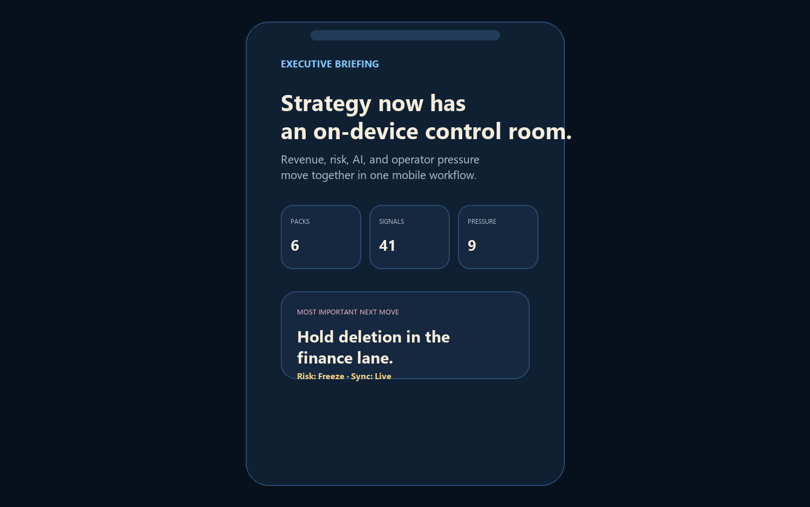
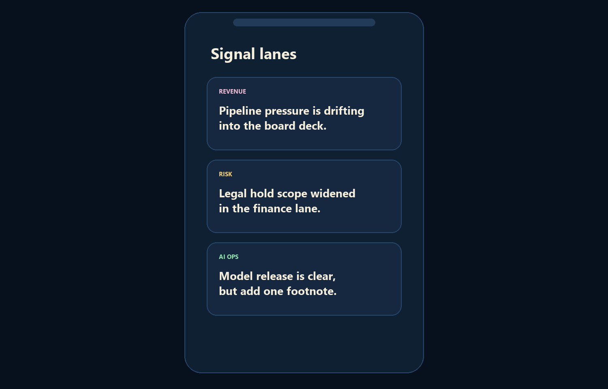
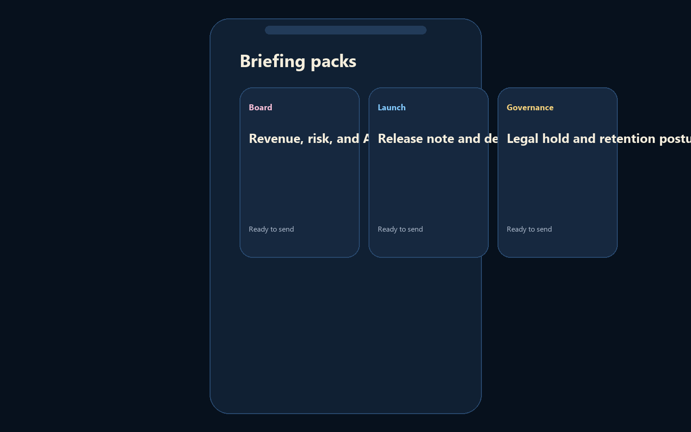
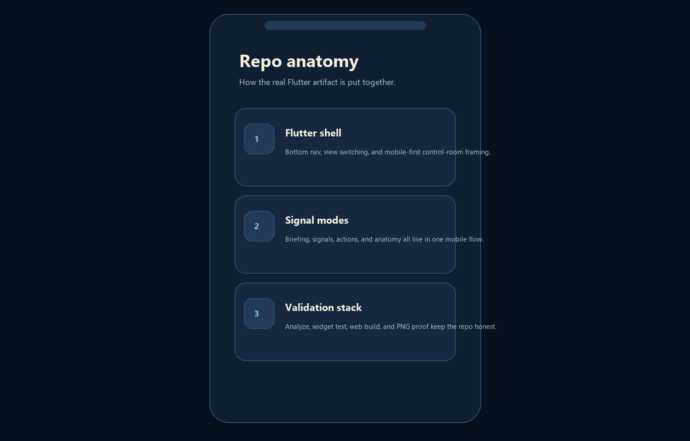

# Mobile Briefing Companion

`mobile-briefing-companion` is a Flutter mobile app for executive briefings, signal summaries, risk updates, and portable strategy review workflows.

It turns the portfolio’s control-room themes into a mobile surface: what changed, why it matters, and which action should move next, all compressed into a phone-first briefing flow.

## Screenshots

### Hero


### Signal Lanes


### Briefing Packs


### Anatomy Mode


## Features

- Mobile-first briefing shell with premium top chrome and bottom navigation
- Revenue, risk, and AI signal lanes
- Board-ready briefing packs
- Action queue with owner and ETA framing
- Repo anatomy mode that explains how the artifact is built
- Runs on Flutter desktop and web targets for quick local proof

## Local Run

```powershell
Set-Location "C:\Users\chaus\dev\repos\mobile-briefing-companion"
$env:Path = "C:\Users\chaus\dev\toolchains\flutter\bin;$env:Path"
flutter pub get
flutter run -d windows
```

If you prefer a browser target:

```powershell
flutter run -d web-server --web-port 4558
```

## Validation

```powershell
Set-Location "C:\Users\chaus\dev\repos\mobile-briefing-companion"
$env:Path = "C:\Users\chaus\dev\toolchains\flutter\bin;$env:Path"
flutter analyze
flutter test
flutter build web
py -3.11 -m pip install -r requirements-dev.txt
py -3.11 scripts\render_readme_assets.py
```

## Repo Layout

- [lib/main.dart](C:/Users/chaus/dev/repos/mobile-briefing-companion/lib/main.dart)
- [test/widget_test.dart](C:/Users/chaus/dev/repos/mobile-briefing-companion/test/widget_test.dart)
- [docs/architecture.md](C:/Users/chaus/dev/repos/mobile-briefing-companion/docs/architecture.md)
- [scripts/render_readme_assets.py](C:/Users/chaus/dev/repos/mobile-briefing-companion/scripts/render_readme_assets.py)
